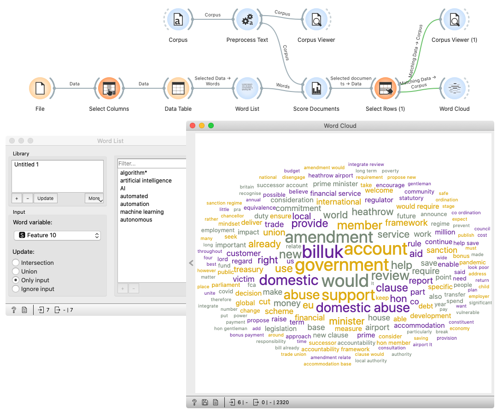

Collect CHANSE data
===================
The repository contains some scripts and Orange workflows to collect and prepare documents for text analysis from three different sources:
* [ParlaMint](https://www.clarin.eu/parlamint/)
* [Overton](https://www.overton.io/)
* [Twitter](https://twitter.com/)

The basic idea of querying is show in *01-Query_ParlaMint.ows*, where we select ParlMint documents according to System Algorithm keywords presence. 

Preprocessed and filtered data can be found in https://datasets.biolab.si/CHANSE/.

Installation
------------

To install dependencies run:

    pip install -r requirements.txt

ParlaMint
---------
Feed the workflows with ParlaMint conllu files. We need a different workflow for each country:
* 04-Collect_ParlaMint_GB.ows
* 05-Collect_ParlaMint_DK.ows
* 06-Collect_ParlaMint_BE.ows
* 07-Collect_ParlaMint_SI.ows

To merge the documents from different years we use:
* 08-Merge_ParlaMint_BE.ows
* 09-Merge_ParlaMint_GB.ows
* 10-Merge_ParlaMint_DK.ows

Overton
-------
For Overton the documents have to be scrapped first.
Overton provided us with .csv files that contain links to the .pdf files (Document URL). We use a script to scrape the .pdfs at urls. 

    python -m scripts.overton_importer

Than querying is done, similar to ParlaMint data:
* 11-Collect_ParlaMint_SI.ows
* 12-Collect_ParlaMint_DK.ows
* 13-Collect_ParlaMint_BE.ows
* 14-Collect_ParlaMint_FI.ows
* 15-Collect_ParlaMint_SE.ows
* 16-Collect_ParlaMint_EN.ows

Twitter
-------
Create a cron job to fetch tweets daily.

    python -m scripts.twitter_scraper

When a sufficient amount of Tweets is fetched, run a script to merge the data in one corpus. 

    python -m scripts.twitter_importer

Then querying can be done:
* 02-Query_Twitter.ows
* 03-Query_Twitter_Language.ows

